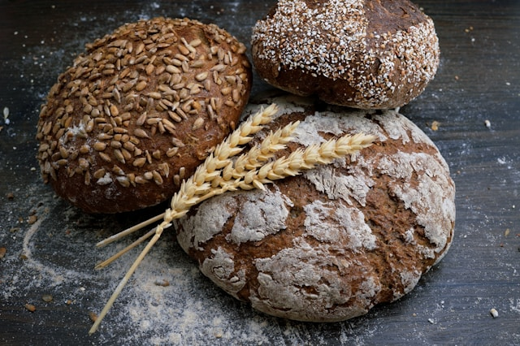

```{r, data generation}
library(knitr) #load necessary package 
library(exams)
include_supplement(file = "bread.jpg", dir = "../images") #necessary for including a picture 


set.seed(123) # seed for replicability -> removed when generating multiple differnt exercises !!!

# set parameters
x_mu <- 1000 #set true mean 
alpha = 0.01 #confidence level 
difference <- FALSE # should the means be different? 
n <- 25 #number of observations 


if(difference){ #define y_mu for sampling, is different from x_mu when the group means should be different 
  y_mu <- x_mu + 20 
} else {
  y_mu <- x_mu 
} 

# sample data 
x <- round(rnorm(n = n, mean = x_mu, sd = 10), digits = 2) #data sampled and rounded 
y <- round(rnorm(n = n, mean = y_mu, sd = 10), digits = 2) 

#create "pretty" dataframe 
data <- data.frame("Manufacturer_A" = x, "Manufacturer_B" = y)

#write a csv file with the data, available for download 
write.csv2(data, file = "bread_data.csv")
```

```{r, question/solutionlist}
#define empty lists 
answers <- list() 
solutions <- list() 
types <- list() 
explanations <- list() 
tolerances <- list() 

# define certain objects (not necessary, but a cleaner workflow)
mean_x <- mean(x)
mean_y <- mean(y)
p_value <- t.test(x, y)$p.value

#mean manufacturer A 
answers[[1]] <- "" #no answer options for numeric questions
solutions[[1]] <- mean_x
types[[1]] <- "num"
tolerances[[1]] <- 0.1 #tolerances only for numeric questions 

#mean manufacturer B 
answers[[2]] <- ""
solutions[[2]] <- mean_y
types[[2]] <- "num"
tolerances[[2]] <- 0.1

#null hypothesis 
answers[[3]] <- c("the mean weight of the bread is the same for manufacturer A and B.", "the mean weight of the bread is different for manufacturer A and B.")  #answer options for single choice 
solutions[[3]] <- if(difference){ c(FALSE, TRUE)} else {c(TRUE, FALSE)} #answer dynamically adjusted depending on the parameters used 
types[[3]] <- "schoice" # single choice 

#p-value 
answers[[4]] <- c("yes", "no", "not enough information in the output to answer")
solutions[[4]] <- if(p_value < alpha){ c(TRUE, FALSE, FALSE)} else{ c(FALSE, TRUE, FALSE)} # answer dynamically adjusted 
types[[4]] <- "mchoice" # multiple choice 

#reject/accept 
answers[[5]] <- c("can reject the null hypothesis.", "cannot reject the null hypothesis.")
solutions[[5]] <- if(p_value < alpha){c(TRUE, FALSE)} else{c(FALSE, TRUE)}
types[[5]] <- "schoice"
```

Question
======== 

The following data was collected from two bread manufacturers. For each manufacturer, `r n` loaves of bread were weighed. The result is the following data table: 

```{r, data table, echo = FALSE, results = "asis"}
kable(data)
```

The data can be downlaoded as a .csv-file here: 

[bread_data.csv](bread_data.csv)



Answer the following questions: 

What is the mean weight of the bread made by manufacturer A? ##ANSWER1##

What is the mean weight of the bread made by manufacturer B? ##ANSWER2## 

Using the function t.test() in R, we can check if the mean weight of the bread differs between the two manufacturerss. Use a signficance level of $\alpha = `r alpha`$

The null hypotheses (H0) is that ##ANSWER3## 

The p-value of the t-test is smaller than $\alpha = `r alpha`$. ##ANSWER4## 

Based on these results, we ##ANSWER5## 

```{r answerlist, echo = FALSE, results = "asis"}
#necessary codeblock which creates an answerlist object from the answers list, which is needed for conversion 

answerlist(unlist(answers), markup = "markdown") # answerlist for exams2html/exams2moodle created from answers list
```

Solution 
========

To find the correct solutions, the function mean() and t.test() were used. The correct solutions are: 

```{r solutionlist, echo = FALSE, results = "asis"}
# feedback format changed from TRUE/FALSE in a vector to strings "True" and "False"
for (i in 1:length(solutions)) {
  if (types[i] %in% c("schoice", "mchoice")) { # only applicable for schoice/mchoice questions
    explanations[i] <- solutions[i] |> lapply(function(x) ifelse(x, "True", "False"))
  } else {
    explanations[i] <- solutions[i] #explanations are the same as solutions 
  }
}

#creates the explanations list needed for conversion 
answerlist(unlist(explanations), markup = "markdown") # answerlist for exams2html/exams2moodle created from solutions/explanations list -> feedback
```

```{r meta, echo = FALSE, results = 'hide'}

# change solution format from TRUE/FALSE vector to 1/0 string
for (i in 1:length(solutions)) {
  if (types[i] %in% c("schoice", "mchoice")) { # only applicable for schoice/mchoice questions
    solutions[i] <- solutions[i] |>
      unlist() |>
      mchoice2string()
  }
}
```

Meta-Information
================
exname: bread_exam
extitle: bread_exam 
exsection: section_1/bread_exam
extype: cloze
exsolution: `r paste(solutions, collapse = "|")`
exclozetype: `r paste(types, collapse = "|")`
extol: `r paste(tolerances, collapse = "|")`
exshuffle: TRUE
exversion: v1
exextra[numwidth,numeric]: 16
exextra[stringwidth,numeric]: 16

